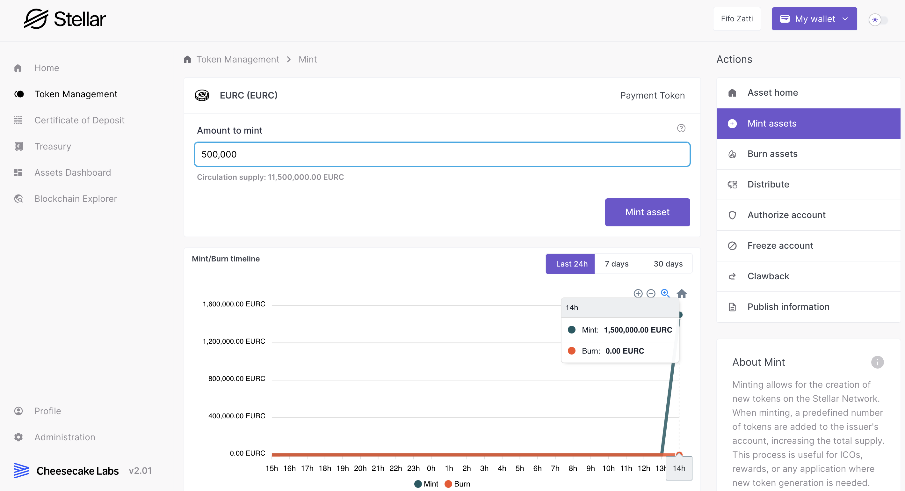

# Supply Management

Supply Management is a crucial function within the Stellar Asset Issuance Sandbox, allowing Asset Managers to meticulously control the total supply of their digital assets. The process is centered around the **Token Main Vault**, which is the nucleus for any supply adjustments such as minting or burning tokens. This specialized management area ensures that only Asset Managers have the power to make changes to the asset's supply, upholding strict levels of security and authority over the assets. For more details on the Token Main Vault, see the dedicated article [token-main-vault.md](../../key-concepts/token-main-vault.md "mention"), that outlines its functions and importance in the asset management process.

## **Accessing Supply Management**

To access the Supply Management feature, Asset Managers should navigate to the 'Token Management' section from the left-side menu. Locate and select the desired asset from the list. Following this, in the asset management area, click on the 'Mint' or 'Burn' options from the right-hand side menu to proceed with adjusting the asset's supply.

<figure><figcaption>
Mint screen
</figcaption></figure>

&#x20;This access is designed to be exclusive to asset managers and secure, reflecting the critical nature of supply adjustments in the digital asset's lifecycle.

## **Minting Supply**

Minting is the act of creating new tokens, directly adding to the asset's circulating supply. When Asset Managers choose to mint new token units, these units are then created and sent to the Main Vault and the increase is immediately reflected in the circulating supply.&#x20;

This process is vital for situations where there is a need to stimulate liquidity or to support growth and expansion activities. The minting action is depicted in the accompanying chart, which provides a historical view of these transactions over time, allowing for an analytical perspective on how minting events have shaped the asset's availability.

## **Burning Supply**

Conversely, burning tokens reduces the circulating supply by permanently destroying selected units. This mechanism is used to decrease the total number of tokens in existence, which can be a strategic move to induce scarcity or to adjust the tokenomics in response to market analysis. The burning events are also recorded and displayed in the chart, offering Asset Managers a visual representation of the supply changes over time and the impact of these decisions on the asset's market presence.\
\
It is important to note that **the 'burn' section only burns supply from the** [token-main-vault.md](../../key-concepts/token-main-vault.md "mention") **balance.** Even though the Stellar network allows for tokens to be burned in different ways, this was a design choice when building the Sandbox to ensure this process is accessible only by users with asset management permission. With this in mind, in case the supply is not in Main Vault, it needs to be transferred to it first.&#x20;

Through the use of these supply management tools, Asset Managers can ensure that the asset's supply is in alignment with its economic model, market demands, and strategic direction.
