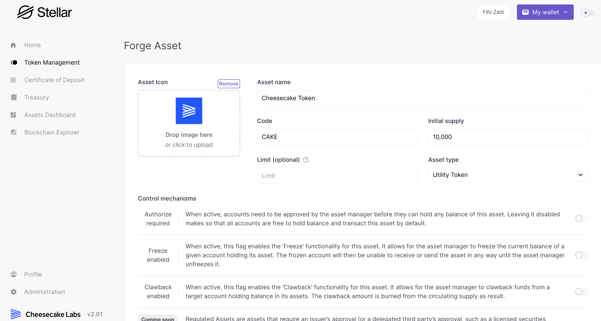

# Token Creation

The Token Creation feature within the Stellar Asset Issuance Sandbox provides a highly flexible and straightforward experience. Users can define and customize their digital tokens with a simple single-step process, covering everything from their visual identity to intricate functional details.

This feature can be easily accessed by navigating to the 'Token Management' option from the left-side menu and then selecting the 'Forge Asset' button located at the top-right corner.

<figure><figcaption>
Token Creation screen
</figcaption></figure>

## **Token Details**

* **Asset Icon:** Allows for the uploading of an image to visually represent the token, enhancing brand recognition.\

* **Asset Name:** Enables the assignment of a distinct name to the token, essential for identification within the network. It represents the long version of the asset name, such as 'Stellar Lumens'.\

* **Code:** A unique code or abbreviation that serves as a critical identifier for transactions and tracking. This represents the short version of the asset name, such as 'XLM'.

## **Supply Parameters**

* **Initial Supply(Optional):** This parameter sets the initial quantity of the token available in the market at its creation, impacting its initial distribution and valuation. It can be left empty if no initial supply should be minted during the token creation.\
  It is possible to further manage the token supply once it is created by accessing its management area.\

* **Limit (Optional):** Establishes a maximum supply for the [token-main-vault.md](../../key-concepts/token-main-vault.md "mention"), useful in managing its rate of issuance and distribution.\

* **Asset Type:** Asset Managers can select the type of the asset, such as a Security Token, which defines its regulatory and operational scope.

## **Control Mechanisms**

Key to defining the asset profile, the control mechanisms define how this asset will behave in the Stellar network, how accounts can interact with it, and which level of control the asset manager holds against that token and its holders. For further details about the underlying mechanisms, refer to Stellar's official documentation [Controlling access to an asset with flags](https://developers.stellar.org/docs/issuing-assets/control-asset-access#controlling-access-to-an-asset-with-flags).

* **Authorize Required:** A control feature for requiring asset manager approval for accounts to hold and transact the token. This feature can be paired with a KYC workflow to ensure that only verified accounts can interact with this asset.\

* **Freeze Enabled:** Gives the asset manager the power to freeze a token balance within an account, controlling its liquidity, as well as allowing for regulatory measures to be applied. When applied, the frozen account loses its authorization to interact with the asset, freezing its balance in place until it is authorized once again.\

* **Clawback Enabled:** Permits the asset manager to retract tokens from an account, useful for correcting transactions and ensuring compliance. It is important to note that, when using the clawback function, the balance is effectively burned from the target account.\
  \
  This feature can be used to retrieve tokens in a lost account and paired with the mint functionality to re-send the lost balance to a new account.\

* **SEP 08 - Regulated Asset (Coming Soon):** A planned feature for assets needing issuer approval per transaction, boosting the token’s security and regulatory adherence. For further details on this standard, refer to its original proposal [SEP08 - Regulated Assets](https://github.com/stellar/stellar-protocol/blob/master/ecosystem/sep-0008.md)&#x20;

